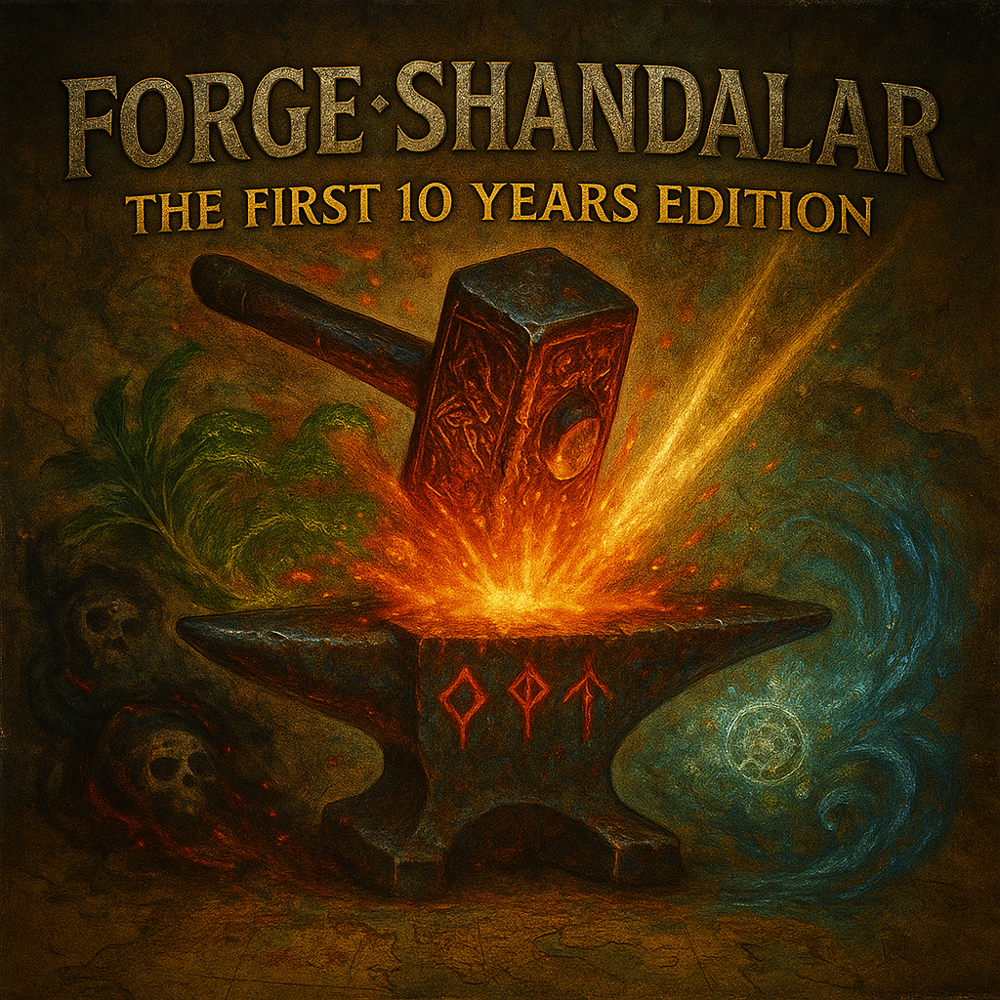

# Forge: Shandalar - "The First 10 Years" Edition

This is a fork of the official **[Forge MTG Engine](https://github.com/Card-Forge/forge)** adventure mode, crafted to recreate a nostalgic "Old-School" Shandalar adventure mode experience, focusing on the golden age of Magic: The Gathering between 1993-2003.

This version updates Forge's Shandalar campaign to primarily use cards with the original ("old-border") frames, focusing on sets from **Alpha through Scourge (up to May 2003)**.

## Modifications

This fork includes changes to:

*   **Card Restrictions:** The default Shandalar format is restricted to old-border sets.
*   **Enemy Decks:** All enemy decks have been reimagined for an authentic old-school experience. The initial decklists were developed by a complex multi-AI-agent framework and continue to be refined through playtesting. At least 30-40 decks have been manually reviewed and improved, including all boss decks.
*   **Shop Inventories & Rewards:** Adjusted to fit the old-school theme and card pool.
*   **Core Code Fixes:** Includes modifications to the core Forge code (`GameFormat.java` and adventure GUI code) to correctly handle reprinted cards within restricted formats, ensuring they appear in shops and rewards as intended when their original printing is allowed.

## Features

*   Authentic "golden-age" of MTG feeling with only old-border cards in Shandalar.
*   Boosters available in shops for many old-border sets.
*   Power 9 cards are extremely rare and only obtainable from specific encounters.

## How to Play

1.  Go to the **[Releases page](https://github.com/vanja-ivancevic/forge-old-school-shandalar/releases)** on the right-hand side of the GitHub repository.
2.  Download the latest `.zip` file listed under "Releases".
3.  Unzip the downloaded file to a location of your choice.
4.  Launch the game using the executable appropriate for your operating system (e.g., `.exe` for Windows, `.sh` for Linux, `.command` for macOS).
## Development Status

✅ **Completed:**

*   Global set and card restrictions for Shandalar based on the old-border era 1993-2003. If you want to further modify the sets in your game, simply add or remove restricted sets in `/res/adventure/common/config.json`.
*   Enemy decks (All processed, playtest feedback welcome!)
*   Basic (mostly) random rewards re-configuration
*   Shop inventories re-configuration including revamped basic land shops
*   Core code fix for reprint handling in restricted formats.
*   Drafting (Note: Jumpstart packs might still appear visually but cannot be played due to restrictions).
*   Items
*   Starter Decks (real precons for each difficulty setting - try them all!)

🔄 **In Progress:**

*   Balance adjustments based on player feedback.

🗓️ **Planned:**

*   Custom maps to suit the story and characters of the early era
*   Custom enemies
*   Custom dungeons

## Feedback and Issues

Please report any bugs or share your feedback specific to this Old-School Shandalar fork on the issues page.

For issues related to the core Forge engine unrelated to these modifications, please refer to the [official Forge repository issues](https://github.com/Card-Forge/forge/issues).

Happy dueling!

---
*This fork is based on the [official Forge repository](https://github.com/Card-Forge/forge) and maintains its [GPL-3.0 License](LICENSE).*
